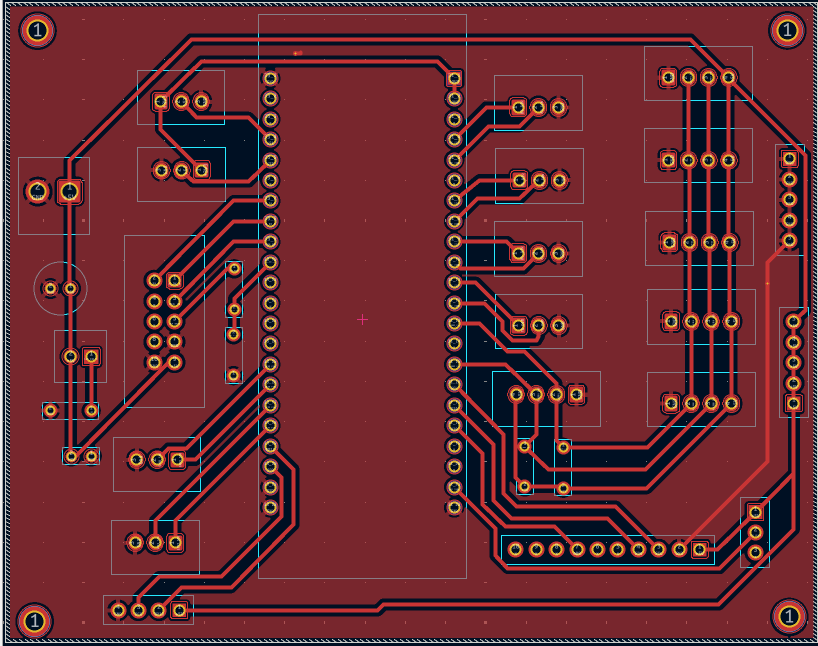
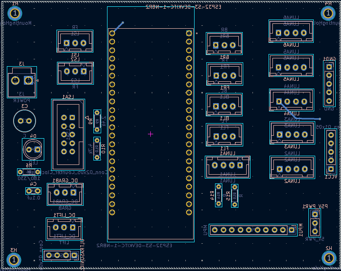
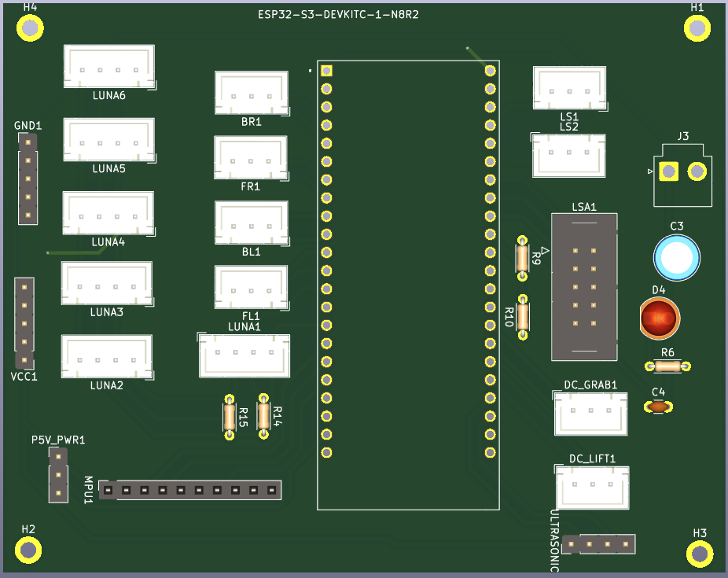
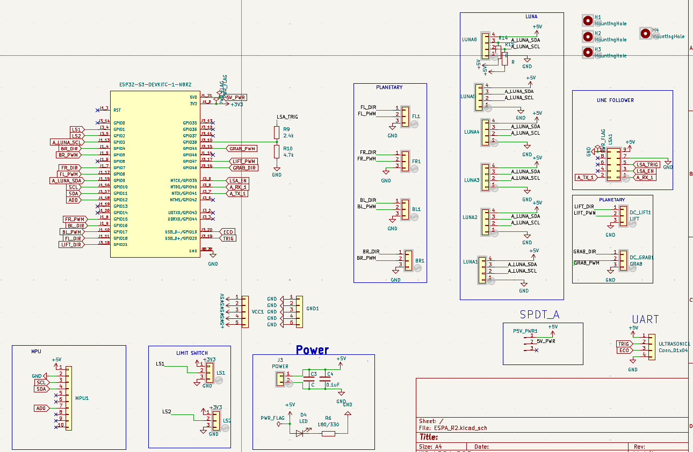

# R2_Robocon_24_Breakout_devboard
ESP32-S3 based breakout PCB designed for Robocon 2024 R2 autonomous robot, supporting sensor interfacing, motor control, and rapid testing of navigation and ball-handling mechanisms.

# Robocon 2024 – R2 Autonomous Breakout PCB with Devboard 

This repository contains the hardware design files for the **R2 Breakout PCB** used for testing Robocon 2024 autonomous robot.

The board was designed as a **ESP32-S3 stackable breakout and testing interface**, enabling direct connection of sensors, motors, and power modules required for autonomous robot development.

---

## 📌 Robot Task Overview

In Robocon 2024, **Robot 2 (R2)** was designed as a fully autonomous robot.

Its primary tasks included:

- Following a predefined path using line follower sensors
- Navigating toward **Area 3**
- Detecting team-colored balls placed in Area 3 (Red/Blue)
- Picking balls and placing them into designated silos

The R2 with devboard breakout PCB enabled rapid testing and integration of sensors, locomotion motors, and mechanism motors required for autonomous navigation and ball placement.

---

## ⚙️ Board Overview

The R2 PCB was developed as a **Initial testing and integration platform**, allowing:

- Direct stacking of **ESP32-S3 Development Board**
- Easy connection of multiple sensors
- Support for locomotion and mechanism motors
- Clean distribution of regulated power inputs
- Rapid hardware testing during autonomous robot development

This modular design simplified debugging and allowed flexible hardware testing during algorithm development.

---

## 🔧 Key Features

- ESP32-S3 compatible stacking layout
- Multiple sensor interface connectors
- Motor control connectors
- Power input connector
- On-board LED indicators
- Decoupling capacitors for stable operation
- Pull-up / current limiting resistors
- Dedicated GPIO breakout headers

---

## 🔌 Supported Sensors

This PCB supported direct connection of commonly used autonomous sensors.

### Sensors Used:

- 6 × Luna Distance Sensors
- MPU9250 (IMU Sensor)
- LSA1 Line Follower Sensor

These sensors were used for navigation, obstacle detection, and path following.

---

## 🎮 Motor Interfaces

The board supported both locomotion and mechanism motors.

### Locomotion Motors:

- 4 Motor connectors for drive system

### Mechanism Motors:

- 2 Motor connectors for grab and lift mechanism

These motors supported locomotion and ball placement operations in silo .

---

## ⚡ Power Interface

Power was supplied through an external regulated source.

### Input:

- Power Input Connector (Voltage supplied externally)

### On-board Components:

- Capacitors for filtering
- Resistors for signal stability
- LED indicators for power/status

---

## 🧠 Application in Autonomous Robot

This breakout board enabled:

- Sensor testing and calibration
- Autonomous navigation testing
- Motor control validation
- Rapid integration of hardware modules

It played a key role in enabling the autonomous behavior of **R2 robot** during Robocon 2024.

---

## 🧰 Hardware Stack

Designed to support:

- ESP32-S3 (Main Controller)
- Line Follower Sensors
- Distance Sensors (Luna)
- MPU9250 (IMU)
- Motor Drivers
- External Power Supply

---

## 📂 Repository Contents

Images/

    ├── R2_3D.png  
    ├── R2_Bottom.png  
    ├── R2_Schematic.png  
    ├── R2_Top.png 

R2_RCU_2024-25

    ├── R2_Breakout.sch  
    ├── R2_Breakout.pcb  
    ├── R2_Breakout.pro      

.gitignore 

README.md

---

## 🛠 Tools Used

- KiCad — Schematic & PCB Design
- ESP-IDF (for ESP32-S3 firmware)

---

## 🎯 Application

This PCB was used in initial testing the **Robocon 2024 R2 Autonomous Robot**, supporting sensor integration, navigation testing, and mechanism control required for ball detection and silo placement.

---

## 👨‍💻 Contribution

Developed as part of Robocon 2024 electronics development, contributing to hardware integration and breakout design for autonomous robot testing.

---

## 📸 PCB Images

### Top Layer

### Bottom Layer

### 3D View

### Schematic

